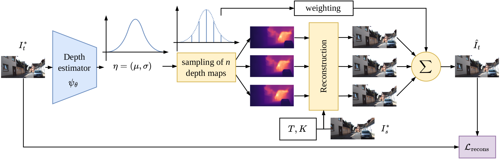

# MonoProb: Self-Supervised Monocular Depth Estimation with Interpretable Uncertainty 

This repository contains the official implementation of **MonoProb: Self-Supervised Monocular Depth Estimation with Interpretable Uncertainty** that has been accepted to the **IEEE Winter Conference on Applications of Computer Vision (WACV) 2024**.



## Requirements

See `requirements.txt`.

## Data
Download KITTI raw dataset and accurate ground truth maps:
```
sh scripts/prepare_kitti_data.sh /path/to/kitti_data
```

## Training

#### MonoProb M <u>without</u> self-distillation:

```
python train.py \
--model_name model_name \
--data_path /path/to/kitti_data \
--log_dir /path/to/save/checkpoints \
--uncertainty \
--distribution normal \
--sample_size 9 \
--uncert_act sigmoid \
--uncert_as_a_fraction_of_depth \
```

#### MonoProb M <u>with</u> self-distillation:

```
python train.py \
--model_name model_name \
--data_path /path/to/kitti_data \
--log_dir /path/to/save/checkpoints \
--uncertainty \
--distribution normal \
--self \
--load_weights_folder /path/of/the/teacher's/checkpoints
--uncert_act no \
```

##### Options for the other training paradigms:

* Training from stereo images only (**S**): `--use_stereo --frame_ids 0 --split eigen_full`
* Training from monocular videos and stereo images only (**MS**): `--use_stereo`


## Evaluation

MonoProb checkpoints are available [here](https://drive.google.com/drive/folders/13BGnwsiCDzip5XEp2GTK_ZwGIpalzF3x?usp=drive_link). Download all checkpoints with:
```
sh scripts/download_checkpoints.sh
```

##### Evaluation scripts:

```
sh scripts/eval_M.sh /path/to/kitti_data
sh scripts/eval_S.sh /path/to/kitti_data
sh scripts/eval_MS.sh /path/to/kitti_data
```

## Citation

```
@misc{marsal2023monoprob,
      title={MonoProb: Self-Supervised Monocular Depth Estimation with Interpretable Uncertainty}, 
      author={Rémi Marsal and Florian Chabot and Angelique Loesch and William Grolleau and Hichem Sahbi},
      year={2023},
}
```

## Acknowledgements

We thank the authors of [Monodepth2](https://github.com/nianticlabs/monodepth2) and of [Mono-uncertainty](https://github.com/mattpoggi/mono-uncertainty) for their great work and for sharing their code.